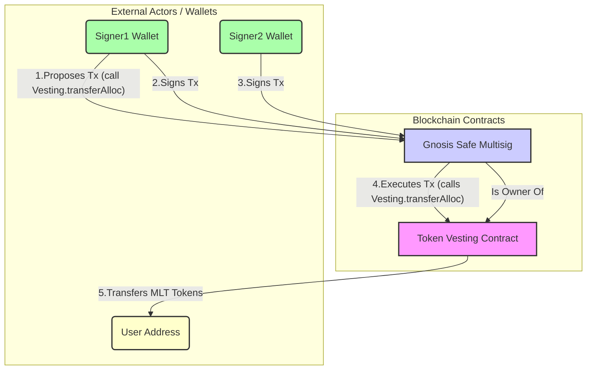

# Using Gnosis Safe as Multisig

## Setup
```
nvm use 20.19.0
yarn install --frozen-lockfile
```

## Deploy Lock contract & set Safe as owner of Lock contract
테스트를 위해 Lock ERC20 컨트랙트를 배포합니다.
```
yarn deploy:lock:sepolia
```

Gnosis Safe 주소를 Lock 컨트랙트의 소유자로 설정합니다.
```
yarn owner:lock:sepolia
``` 

## Scenario Overview

### Description
1. 사이너1(승인자)이 토큰을 유저2에게 전송하는 트랜잭션을 만들고 본인이 승인
2. 사이너2(승인자)에게 승인 요청
3. 사이너2이 승인
4. 유저의 지갑에 토큰이 최종 전달됨



### Run with general Safe transaction
두 명의 서명자의 승인을 필요로 하는 Gnosis Safe 멀티시그 컨트랙트를 통해 USER2 주소로 100 MLK 토큰을 전송하는 트랜잭션입니다.
```
yarn transfer:admin:sepolia
yarn transfer:user:sepolia
```
  
### Run with STS(Safe Transaction Service)
API 키가 필요하고 웹 UI에서 트랜잭션을 관리할 수 있는 Safe Transaction Service를 사용하여 USER2 주소로 100 MLK 토큰을 전송하는 트랜잭션입니다. 이 트랜잭션에는 두 명의 서명자가 참여합니다.
```
yarn sts:admin:sepolia
yarn sts:user:sepolia
```

### Run with STS II
이는 STS를 통해 USER2 주소로 100 MLK 토큰을 전송하기 위한 첫 번째 승인 요청 트랜잭션을 보내고, 두 번째 서명자가 Safe 웹 UI에서 해당 요청을 승인하도록 하기 위한 것입니다.
```
yarn sts:admin:sepolia
```
이 명령 이후에는 Safe 웹 UI에서 USER 주소(=USER2 아님)를 사용하여 요청을 승인할 수 있습니다.